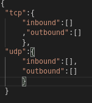

# Read Me
## Testing
The code is tested for various types of rules like
 
<code>
inbound,tcp,1-65535,0.0.0.0-255.255.255.255  
outbound,udp,1,0.0.0.0  
.  
.  
.  
inbound,tcp,80,192.168.1.5  
inbound,tcp,81,192.168.1.5  
inbound,tcp,69,0.0.0.0-0.0.1.0  
inbound,tcp,69,0.0.0.0-255.255.255.0  
inbound,tcp,80,192.168.1.2  
outbound,tcp,10000-20000,192.168.10.11  
inbound,udp,53,192.168.1.1-192.168.2.5  
outbound,udp,1000-2000,152.12.48.92  
inbound,udp, 190, 0.0.0.0-0.0.0.0  
inbound,tcp,1-65535,0.0.0.0-255.255.255.254

</code>
  

Matches first rule

 
 
Matches  second rule

However, the script is not tested against large input file.

## Design paradigm  

In order to reduce search space, which in turn will reduce time, I implemented nested dictionary. The reason why i used nested dictionary is because the access time of dictionary is O(1) which decreases search space by significant factor of 4. Also, we dont need to check again for protocols and direction of packets.

 
## Further Improvements  
Now the problem with my solution is we still need to loop (65535 x 4294967295 (MAX_IP_POSSIBLE)) times (worst case possible), if the csv of rules has that many individual entries(not range). That is, my algorithm will perform O(n) times where n is the total number of rules.  
<code>
inbound,tcp,1,0.0.0.1        
inbound,tcp,1,0.0.0.2      
inbound,tcp,1,0.0.0.3   
.  
.  
.    
inbound,tcp,1,255.255.255.254  
inbound,tcp,1,255.255.255.255  
inbound,tcp,2,0.0.0.1  
inbound,tcp,2,0.0.0.2  
.  
.  
inbound,tcp,65535,255.255.255.255  
</code>

To tackle this problem we can try to sort the dictionary by ip_address and port_number to perform binary search on ip_address which will have time complexity O(log n) and, then just search for port number linearly which will make final time complexity O(log n + 65535). Provided that rules doesnt have any ranges for ip_address and port_number.

## Interested In
<ul>
    <li>Data Team</li>
    <li>Platform Team</li>
</ul>
